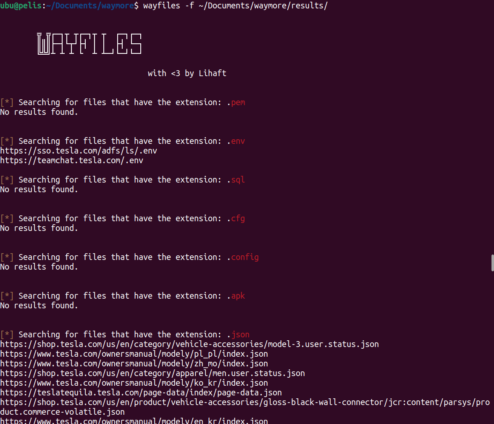

<h1 align="center">
  
  <br>
</h1>


<p align="center">
<a href="https://github.com/Rffrench/wayfiles">

</a>
<a href="https://twitter.com/LihaftSec">

</a>
</p>

<br>


# About Wayfiles
Wayfiles is a hacking tool designed to search for juicy files and URLs within a folder/file with results of tools like `gau`, `waymore`, `waybackurls`, etc.

👉🏻 Many URLs that are archived in the Wayback Machine, Common Crawl or AlienVault may still be live and accesible, which is specially valuable if you are a Bug Hunter. Also, if you encounter files that are not live anymore, you can still try accesing them using any of the previous services mentioned. Maybe you find some old credentials in some archived file or something valuable that can still be abused today.

In order to use `wayfiles`, you only need to specify a folder with results or a file with URLs and Wayfiles will do the rest.

Wayfiles was also designed to be pipable to other tools such as `httpx`. Only specify the `-s` flag and pipe the results found to check which URLs are still live.


 
  <br>

# Installation
If Go is installed and in your PATH then just run: 
```bash
go install github.com/Rffrench/wayfiles@latest
```

# Usage
```bash
Usage of wayfiles:
  -e string
    	Exclude certain extensions to search for in the format of: ext1,ext2,ext3 E.g.: -e db,pdf,doc
  -ext
    	Print the list of extensions by default
  -f string
    	File/path for either a file with URLs or a directory with Wayback Machine results. (E.g.: wayfiles -f urls.txt | wayfiles -f ~/waymore/results | wayfiles -f .)
  -h	Prints help menu
  -i string
    	Include extra extensions to search for in the format of: ext1,ext2,ext3 E.g.: -i php,js,aspx
  -l string
    	Use a custom list with extensions instead of using the default ones. The list must include one extension per line. E.g: php (newline) js (newline) aspx (newline) etc
  -s	Silent/Pipable mode. Not verbose mode. Just print the URLs to stdout
  -version
    	Print version number

```
<br>

# Examples

### Simple usage
The most **basic way** of using `wayfiles` is by specifying the `-f` flag. This flag is **REQUIRED** and is used to specify a file or folder to search for files.

```bash
wayfiles -f <file/folder>
```

<br>

### Including extensions
A default list of extensions is included for you, but you can also **include extra extensions** using the `-i` flag separated by a comma:

```bash
wayfiles -f <file/folder> -i js,php,aspx
```

<br>

### Excluding extensions
Same if you want to **exclude certain extensions** of the default list:

```bash
wayfiles -f <file/folder> -e yml,env,json
```
***NOTE: flags `-i` and `-e` can be used in conjunction.*** 💯

<br>

### Using a custom list of extensions
Or if you want to use your own **list of extensions** you can do so with the `-l` flag and a list containing each extension in a different line:

**Example list:**
```txt
js
php
aspx
```

```bash
wayfiles -f <file/folder> -l extensions.txt
```

<br>

### Piping output (silent mode)
Finally, `wayfiles` has also been designed to be used in conjuction with other tools such as `httpx`. Results can be piped to other tools by using the flag `-s` and print only the URLs found.

```bash
wayfiles -f <file/folder> -s
```

<br>

# List of default extensions
You can print the list of default extensions by running:

```bash
wayfiles -ext
```

If you have any suggestions of adding or removing extensions please reach out.

I have dediced to include a table with each extension included and its description. Note that not every extension is sensitive by default:

| Extension  | Full Name                  | Comment                                   |
|------------|----------------------------|-------------------------------------------|
| `pem`      | Privacy Enhanced Mail      | Contains sensitive SSL/TLS private keys.  |
| `env`      | Environment               | Configuration files with sensitive data and environment variables.  |
| `sql`      | Structured Query Language  | SQL files may contain juicy data.                  |
| `cfg`      | Configuration              | Config files may contain sensitive data.               |
| `config`   | Configuration              | Various software configuration files. Config files may contain sensitive data.     |
| `apk`      | Android Package            | Android apps that are found that are not public or of previous versions may lead to some bugs              |
| `json`     | JavaScript Object Notation | JSON files may contain sensitive data.                  |
| `yml`      | YAML                       | YAML files may contain sensitive data.              |
| `yaml`     | YAML                       | YAML files may contain sensitive data.        |
| `xml`      | Extensible Markup Language | XML files may contain sensitive data, errors, code, etc.      |
| `log`      | Log                        | Log files may contain sensitive info.|
| `git`      | Git Repository             | If you find one of these you probably won the jackpot.   |
| `enc`      | Encoded                    | Encoded or encrypted files.              |
| `key`      | Key                        | Encryption keys and certificates.         |
| `ini`      | Initialization             | Initialization and configuration files.   |
| `ps1`      | PowerShell Script          | Powershell scripts that are public may contain sensitive data.               |
| `sh`       | Shell Script               | Shell scripts that are public may contain sensitive data.                       |
| `bat`      | Batch Script               | Batch scripts that are public may contain sensitive data.                    |
| `exe`      | Executable                 | Binaries that are found may be internal. Try them out! (be careful)                 |
| `cgi`      | Common Gateway Interface   | CGI scripts may contain sensitive data or be executed.                   |
| `msi`      | Windows Installer Package  | MSIs that are found may be internal. Try them out! (be careful)    |
| `jar`      | Java Archive               | Java archive files.                      |
| `py`       | Python Script              | Python source code. Sometimes this may contain sensitive data.                      |
| `db`       | Database                   | General database file extension.         |
| `mdb`      | Microsoft Access Database  | Microsoft Access database files.         |
| `bak`      | Backup                     | Backup files.                            |
| `bkp`      | Backup                     | Backup files (alternative extension).    |
| `bkf`      | Backup                     | Windows Backup Utility files.           |
| `inc`      | Include                    | Source code include files.               |
| `asa`      | ASP.NET Configuration      | ASP.NET configuration files.             |
| `old`      | Old                        | Old or obsolete files. Usually a backup copy of a newer version of an opened file.                   |
| `iso`      | Disk Image                 | ISO files may not be public. Worth checking them out.                      |
| `bin`      | Binary                    | Binary files (various purposes).         |
| `swf`      | Shockwave Flash            | Adobe Flash animation files.             |
| `pl`       | Perl Script                | Perl source code.                        |
| `htm`      | Hypertext Markup           | HTM files are usually used in older sites. If you find a site using one of these it may be worth checking.                          |
| `txt`      | Text                       | Text files may contain sensitive data.                        |
| `doc`      | Document                   | Word docs may contain sensitive data. Lots of garbage may be found though.         |
| `docx`     | Document                   | Word docs may contain sensitive data. Lots of garbage may be found though.    |
| `xls`      | Excel                      | Spreadsheets may contain sensitive data. Lots of garbage may be found though.      |
| `xlsx`     | Excel                      | Spreadsheets may contain sensitive data. Lots of garbage may be found though.|
| `ppt`      | PowerPoint                 | Presentations may contain sensitive data. Lots of garbage may be found though. |
| `pptx`     | PowerPoint                 | Presentations may contain sensitive data. Lots of garbage may be found though.|
| `pdf`      | Portable Document Format   | PDFs may contain sensitive data. Lots of garbage may be found though.               |
| `eml`      | Email Message              | Emails are emails.            |
| `email`    | Email Message              | Emails are emails.  |
| `msg`      | Outlook Message            | Emails are emails.       |
| `gadget`   | Gadget                     | Small programs used to monitor a system. Rare to find.                |
| `tmp`     | Temporary                  | Temporary files.  
| `temp`     | Temporary                  | Temporary files.               |
| `xz`       | XZ Compressed              | Compressed files may contain sensitive data.           |


<br>

# Disclaimer
✅ If you have any questions or comments you can send me a DM in X/Twitter: **@LihaftSec**

Also, PRs are open in case you want add a new extension to the default list or just improve the tool :) I will review each suggestion.
 